Transformer without Explicit Segmentation
===

"Transformer without Explicit Segmentation" running on Tensor2Tensor Library.

---

## Introduction

It implements the embedding algorithm suggested in the paper "Fully Character-Level Neural Machine Translation without Explicit Segmentation". We call this embedding algorithm as "Character-Aware Embedding" from now on.

The embedding is working with the Transformer architecture, which was suggested in the paper "Attention Is All You Need".

I'm researching which embedding variation or input-output type gets better performance currently.

* Comparison with Word/SubWord/Character/Byte-level input embedding
* Comparison with Word/SubWord/Character/Byte-level output embedding
* Multi CNN Layers instead of a CNN layer

## Technical Report

The effect of explicit segmentation may be revealed obviously in "Hard to Segment" languages such as Chinese, Japanese, Korean. That is, without Character-Aware Embedding, translations from "Hard to Segment" languages to easy to segment languages are difficult to get good performances until we use tokenizing preprocessing.

Therefore, I focus on the translation tasks from that kind of languages. In fact, it turns out those languages takes little training time than alphabetic languages, as their word lengths are generally shorter than alphabetic languages and we fix the max-pooling size.

### 1. Word-level output

We use small Korean-English parallel data.

#### 1.1. Comparison
Word-level input embedding is named 'koen_simple' and Character-Aware input embedding is named 'koen_char2word_simple'. As you can see, The evaluation loss of 'koen_char2word_simple' reduces more and faster than 'koen_simple'. Furthermore, training time is also reduced by reduction of time_step due to max-pooling.
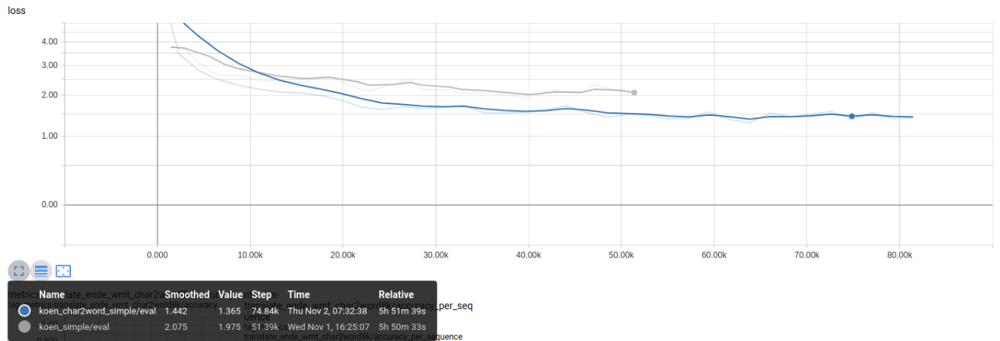
*Fig 1. Evaluation Loss Comparison (Word-level Output)*

Furthermore, 'koen_char2word_simple' performs better or same in many metrics.
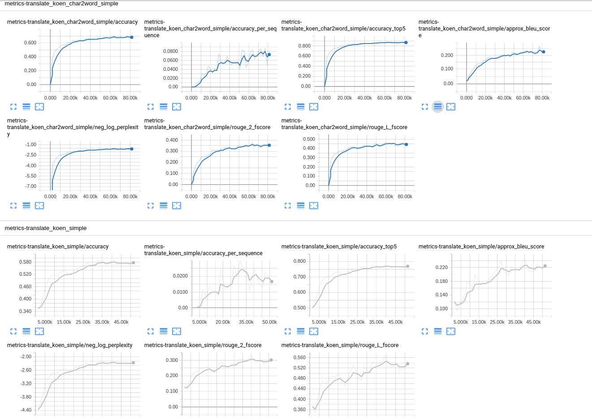
*Fig 2. Evaluation Metrics Comparison (Word-level Output)*

In terms of Out-of-vocabulary(OOV), 'koen_char2word_simple' is more robust due to convolution and character-level embedding scheme.

| Input \ Model | 'koen_char2word_simple' | 'ko_en_simple' |
|---|---|---|
| 바보 | 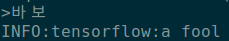 | 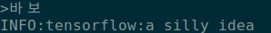 |
| 바아보 | 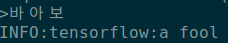 | 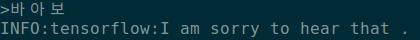 |
| 바아아보 | 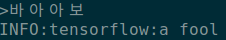 |  |
| 아버지가방에들어가신다. | 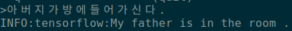 | 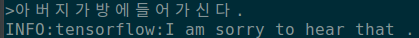 |
| 아버지가 방에 들어가신다. | 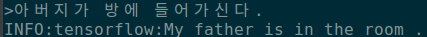 | 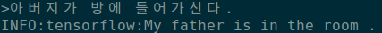 |
| 아버지 가방에 들어가신다. | 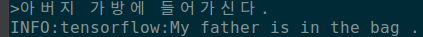 | 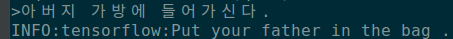 |
*Table 1. OOV Test for some sentences (Word-level Output)*

### 2. SubWord-level Output

### 3. Character-level Output

### 4. Byte-level Output

---
## Issues

## Reference
* [Attention Is All You Need](https://arxiv.org/pdf/1706.03762.pdf)
* [Fully Character-Level Neural Machine Translation without Explicit Segmentation](https://arxiv.org/pdf/1610.03017.pdf)
* [Character-Aware Neural Language Models](https://arxiv.org/pdf/1508.06615.pdf)
