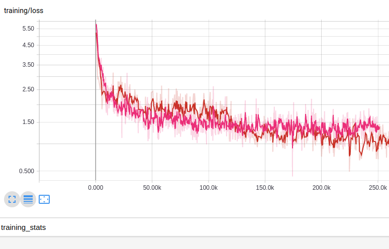
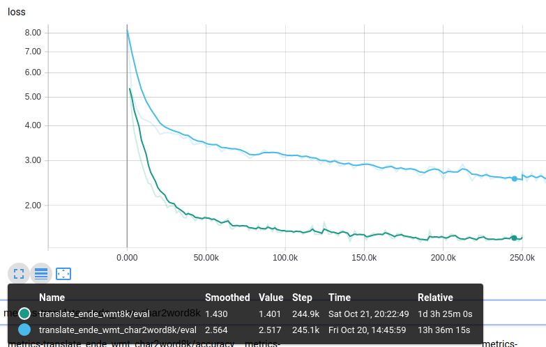
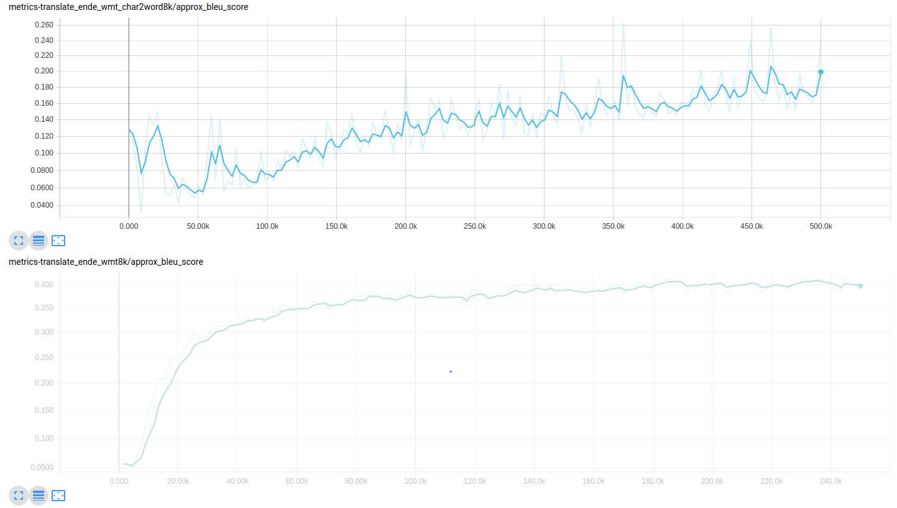
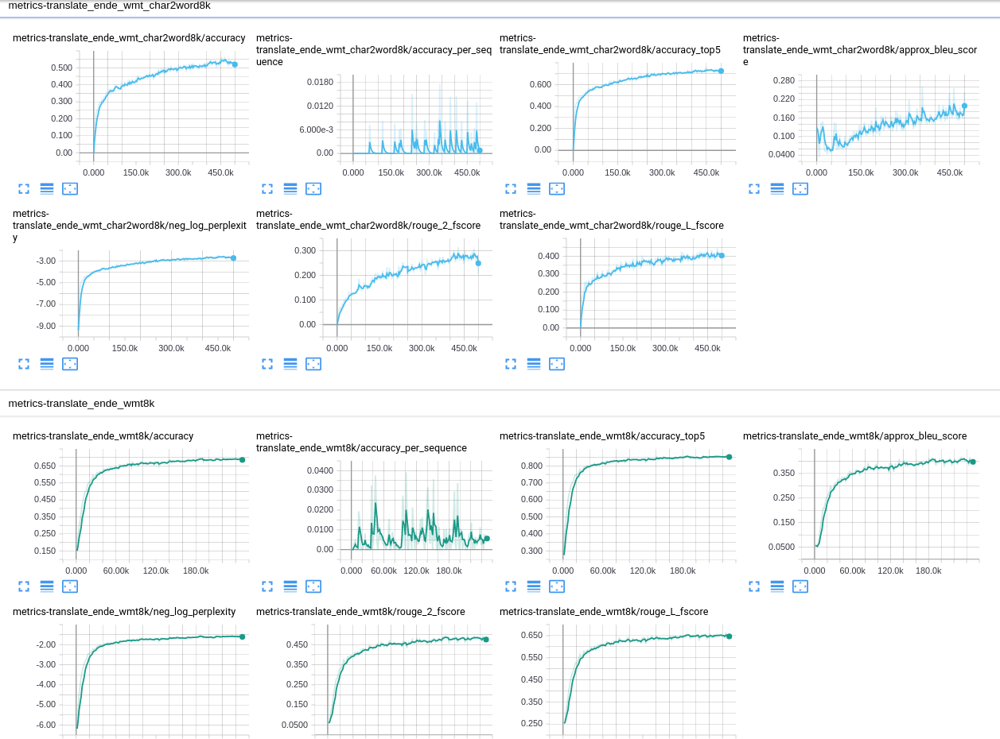

# Transformer-without-Explicit-Segmentation
"Transformer without Explicit Segmentation" running on Tensor2Tensor Library.

---

## Introduction

It implements the embedding algorithm suggested in the paper "Fully Character-Level Neural Machine Translation without Explicit Segmentation".

The embedding is working with the Transformer architecture, which was suggested in the paper "Attention Is All You Need".

I'm researching which embedding variation or input-output type gets better performance currently.

## Technical Report

### 1. Comparison [output type: (sub) word-level]
The result is not quite good currently.
Solving the discrepancy betweent training loss and evaluation loss would make it get better.

### 2. Comparison [output type: character-level]

## Reference
* [Attention Is All You Need](https://arxiv.org/pdf/1706.03762.pdf)
* [Fully Character-Level Neural Machine Translation without Explicit Segmentation](https://arxiv.org/pdf/1610.03017.pdf)
* [Character-Aware Neural Language Models](https://arxiv.org/pdf/1508.06615.pdf)
